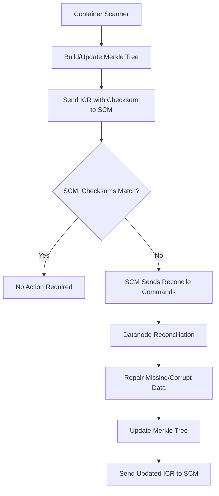

<!--
  Licensed under the Apache License, Version 2.0 (the "License");
  you may not use this file except in compliance with the License.
  You may obtain a copy of the License at

   http://www.apache.org/licenses/LICENSE-2.0

  Unless required by applicable law or agreed to in writing, software
  distributed under the License is distributed on an "AS IS" BASIS,
  WITHOUT WARRANTIES OR CONDITIONS OF ANY KIND, either express or implied.
  See the License for the specific language governing permissions and
  limitations under the License. See accompanying LICENSE file.
-->

# Container Reconciliation - Detailed Implementation Design

## Executive Summary

Container Reconciliation is a comprehensive system for detecting and repairing data inconsistencies between container replicas in Apache Ozone. The implementation uses a three-level Merkle tree structure to efficiently identify differences and enables datanodes to autonomously reconcile their container data with peer replicas. This document provides a detailed analysis of the implemented solution based on the differences between the HDDS-10374-scanner-builds-mt branch and master.

## Table of Contents

1. [Architecture Overview](#architecture-overview)
2. [Core Components](#core-components)
3. [Merkle Tree Implementation](#merkle-tree-implementation)
4. [Reconciliation Process](#reconciliation-process)
5. [Scanner Integration](#scanner-integration)
6. [SCM Coordination](#scm-coordination)
7. [Protocol and API Changes](#protocol-and-api-changes)
8. [Performance and Scalability](#performance-and-scalability)
9. [Safety and Reliability](#safety-and-reliability)
10. [Configuration](#configuration)
11. [Metrics and Monitoring](#metrics-and-monitoring)
12. [Testing Strategy](#testing-strategy)
13. [Future Enhancements](#future-enhancements)

## Architecture Overview

### System Design Principles

The Container Reconciliation feature follows several key architectural principles:

1. **Defensive Datanode Behavior**: Datanodes make only safe decisions locally and defer potentially unsafe operations to SCM
2. **Peer-to-Peer Architecture**: Distributes reconciliation workload across datanodes rather than centralizing in SCM
3. **Event-Driven Processing**: Uses the existing SCM command framework for asynchronous reconciliation
4. **Safety First**: Prioritizes data preservation over performance when conflicts arise

### High-Level Flow



## Core Components

### 1. ContainerChecksumTreeManager

**Purpose**: Central coordinator for container checksum operations across all containers on a datanode.

**Key Features**:
- **Thread-Safe Operations**: Uses striped locks (configurable via `DatanodeConfiguration.containerChecksumLockStripes`) to prevent bottlenecks while ensuring consistency
- **Atomic File Updates**: Implements atomic writes using temporary files and `ATOMIC_MOVE` to prevent corruption during concurrent access
- **Container Comparison**: Provides detailed diff capabilities between container checksums from different replicas
- **Deleted Block Tracking**: Maintains awareness of deleted blocks to handle cleanup scenarios during reconciliation

**File Format**: Container checksums are stored as protobuf files on disk separately from RocksDB to avoid bloating the main database.

### 2. ContainerMerkleTreeWriter

**Responsibility**: Builds and maintains the three-level Merkle tree structure for containers.

**Tree Structure**:
```
Level 3 (Root): Container Checksum
    ├── Level 2: Block Checksum 1
    │   ├── Level 1: Chunk Checksum 1.1
    │   ├── Level 1: Chunk Checksum 1.2
    │   └── Level 1: Chunk Checksum 1.N
    ├── Level 2: Block Checksum 2
    └── Level 2: Block Checksum N
```

**Design Decisions**:
- **Consistent Hashing**: Uses CRC32C for all checksum aggregation regardless of underlying data checksum algorithm
- **Deterministic Ordering**: Maintains sorted order (chunks by offset, blocks by ID) for consistent checksums across replicas
- **Incremental Building**: Supports both full reconstruction and incremental updates

### 3. ReconcileContainerTask

**Function**: Executes the actual reconciliation logic between container replicas.

**Key Operations**:
1. **Peer Communication**: Uses `DNContainerOperationClient` to retrieve checksums from peer datanodes
2. **Diff Analysis**: Compares local container checksum with peer checksums to identify inconsistencies
3. **Data Repair**: Downloads missing or corrupt chunks/blocks from healthy peers
4. **Metadata Updates**: Updates local RocksDB and rebuilds Merkle tree
5. **Notification**: Sends updated container checksum to SCM via ICR

### 4. KeyValueHandler Enhancements

**New Method**: `reconcileContainer(DNContainerOperationClient dnClient, Container<?> container, Collection<DatanodeDetails> peers)`

**Reconciliation Logic**:
```java
for (DatanodeDetails peer : peers) {
    ContainerChecksumInfo peerChecksum = getPeerChecksum(peer);
    ContainerDiffReport diff = compareChecksums(localChecksum, peerChecksum);
    
    // Repair missing blocks
    for (Block missingBlock : diff.getMissingBlocks()) {
        downloadAndStoreBlock(peer, missingBlock);
    }
    
    // Repair corrupt chunks
    for (Chunk corruptChunk : diff.getCorruptChunks()) {
        if (peerChunk.isHealthy() && !localChunk.isHealthy()) {
            downloadAndReplaceChunk(peer, corruptChunk);
        }
    }
    
    // Update local checksum
    rebuildMerkleTree();
}
```

## Merkle Tree Implementation

### Three-Level Structure

#### Level 1: Chunk Checksums
- **Source**: Client-provided checksums stored during write operations
- **Validation**: Verified by container scanners against actual chunk data on disk
- **Storage**: Persisted in RocksDB metadata

#### Level 2: Block Checksums  
- **Computation**: Aggregation of all chunk checksums within a block
- **Algorithm**: CRC32C hash of concatenated chunk checksums
- **Ordering**: Chunks sorted by offset for consistency

#### Level 3: Container Checksum
- **Computation**: Aggregation of all block checksums within a container
- **Algorithm**: CRC32C hash of concatenated block checksums  
- **Ordering**: Blocks sorted by block ID
- **Reporting**: This top-level hash is reported to SCM for divergence detection

### Merkle Tree Properties

**Consistency**: Two container replicas have identical Merkle trees if and only if they contain the same blocks with the same chunk data.

**Efficiency**: Allows for quick identification of differences without transferring entire container contents.

**Incremental Updates**: Can be updated as blocks are added, modified, or deleted without full reconstruction.

### Deleted Block Handling

Deleted blocks are tracked separately in the Merkle tree to handle scenarios where:
- One replica has processed block deletions while another has not
- Reconciliation occurs across software versions with different deletion handling
- Block deletion commands are processed out of order

## Reconciliation Process

### Phase 1: Detection and Triggering

1. **Container Scanning**: Background or on-demand scanners build/update Merkle trees
2. **ICR Generation**: Datanodes send container checksums to SCM via Incremental Container Reports
3. **Divergence Detection**: SCM identifies container replicas with mismatched checksums
4. **Eligibility Check**: `ReconciliationEligibilityHandler` validates:
   - Container state (CLOSED or QUASI_CLOSED)
   - Replica states (CLOSED, QUASI_CLOSED, or UNHEALTHY)
   - Replication type (RATIS only, EC not supported)
   - Replica count (>1 required)

### Phase 2: Command Distribution

1. **Command Creation**: SCM creates `ReconcileContainerCommand` for each replica
2. **Peer Information**: Command includes details of all other replicas for the container
3. **Async Delivery**: Commands sent via existing datanode heartbeat protocol
4. **Leader Term**: Commands include SCM leader term for validation

### Phase 3: Peer-to-Peer Reconciliation

Each datanode receiving a reconcile command:

1. **Peer Iteration**: Contacts each peer replica sequentially
2. **Checksum Exchange**: Retrieves peer Merkle trees via `getContainerChecksumInfo` API
3. **Diff Analysis**: Uses `ContainerDiffReport` to identify:
   - **Missing Blocks**: Entire blocks not present locally
   - **Missing Chunks**: Individual chunks within existing blocks  
   - **Corrupt Chunks**: Chunks with different checksums where peer is healthy
4. **Data Repair**: Downloads missing/corrupt data from healthy peers
5. **Local Updates**: Updates RocksDB metadata and chunk files
6. **Tree Rebuild**: Reconstructs Merkle tree with repaired data
7. **SCM Notification**: Sends updated ICR with new container checksum

### Phase 4: Verification

1. **Checksum Convergence**: SCM monitors that all replicas report identical checksums
2. **Reconciliation Metrics**: Tracks success/failure rates and performance
3. **Error Handling**: Retries failed reconciliations with exponential backoff

## Scanner Integration

### Enhanced Scanner Architecture

The container reconciliation feature significantly enhances the existing scanner framework:

#### ContainerScanHelper

**Purpose**: Consolidates common scanning logic across background and on-demand scanners.

**Capabilities**:
- Unified scan result handling (`DataScanResult`, `MetadataScanResult`)
- Merkle tree building during scan operations
- Enhanced error categorization and reporting
- Metrics collection and aggregation

#### Background Scanner Changes

**Data Scanner Enhancements**:
- Calls `controller.updateContainerChecksum()` after successful scans
- Builds Merkle trees incrementally during normal scanning
- Improved volume failure handling and recovery

**Metadata Scanner Updates**:
- Simplified implementation using `ContainerScanHelper`
- Enhanced validation of container metadata consistency
- Better integration with Merkle tree updates

#### On-Demand Scanner

**Architecture Change**: Converted from static utility to instance-based component managed by `ContainerController`.

**Benefits**:
- Better lifecycle management
- Integration with container-specific operations
- Improved callback handling for scan completion

### Scan Results Enhancement

#### DataScanResult
- **Healthy Chunks**: Count of chunks with matching checksums
- **Unhealthy Chunks**: Count of chunks with checksum mismatches
- **Scan Duration**: Performance metrics
- **Error Details**: Specific failures encountered

#### MetadataScanResult  
- **Metadata Validation**: RocksDB consistency checks
- **Schema Validation**: Ensures proper key-value structure
- **Inconsistency Detection**: Identifies metadata corruption

## SCM Coordination

### Event-Driven Architecture

The SCM coordinates reconciliation through an event-driven architecture:

#### ReconcileContainerEventHandler

**Responsibilities**:
- Processes container reconciliation events
- Validates SCM leader status (only leader processes events)
- Creates and distributes reconcile commands
- Tracks reconciliation progress

**Event Sources**:
- Manual CLI requests (`ozone admin container reconcile`)
- Automatic detection of checksum mismatches
- Periodic reconciliation of closed containers (future)

#### Command Protocol Integration

**ReconcileContainerCommand**:
- Extends existing SCM command framework
- Contains container ID and peer datanode details
- Includes deadline and term information
- Processed asynchronously by datanodes

### Leader-Only Processing

To prevent split-brain scenarios during SCM HA:
- Only SCM leader processes reconciliation events
- Commands include leader term for validation
- Follower SCMs ignore reconciliation requests

## Protocol and API Changes

### New Protocol Messages

#### Container Checksum Exchange
```protobuf
message GetContainerChecksumInfoRequest {
  int64 containerID = 1;
}

message GetContainerChecksumInfoResponse {
  ContainerChecksumInfo checksumInfo = 1;
}

message ContainerChecksumInfo {
  ContainerMerkleTree merkleTree = 1;
  repeated int64 deletedBlocks = 2;
}
```

#### Merkle Tree Structure
```protobuf
message ContainerMerkleTree {
  int64 containerID = 1;
  repeated BlockMerkleTree blockMerkleTrees = 2;
  ChecksumData checksumData = 3;
  int64 length = 4;
  int64 blockCount = 5;
  int64 reconciliationCount = 6;
}

message BlockMerkleTree {
  BlockData blockData = 1;
  ChecksumData checksumData = 2;
  bool deleted = 3;
  int64 length = 4;
  int64 chunkCount = 5;
}
```

### Admin CLI Extensions

#### Manual Reconciliation
```bash
ozone admin container reconcile <container-id>
```

**Features**:
- Triggers immediate reconciliation for specified container
- Asynchronous execution with progress tracking
- Integration with existing container info commands

#### Enhanced Container Info
```bash
ozone admin container info <container-id>
```

**Enhancements**:
- Shows container checksum information
- Displays reconciliation status and history
- Provides detailed replica state information

## Performance and Scalability

### Optimizations Implemented

#### Striped Locking
- **Configuration**: `DatanodeConfiguration.containerChecksumLockStripes`
- **Default**: 64 stripes
- **Benefit**: Prevents lock contention during concurrent checksum operations

#### Atomic File Operations
- **Method**: Temporary files with `ATOMIC_MOVE`
- **Benefit**: Prevents corruption during concurrent reads/writes
- **Overhead**: Minimal additional disk I/O

#### Incremental Merkle Tree Building
- **Strategy**: Build trees during normal scanning operations
- **Benefit**: Amortizes computation cost over time
- **Trade-off**: Some memory overhead for tree maintenance

#### Configurable Buffer Sizes
- **Parameter**: `DatanodeConfiguration.containerReconciliationChunkBufferSize`
- **Default**: 1MB
- **Tuning**: Allows optimization for memory vs. performance

### Scalability Considerations

#### Peer-to-Peer Architecture
- **Distribution**: Reconciliation load spread across datanodes
- **Bandwidth**: Uses existing datanode-to-datanode communication
- **Concurrency**: Multiple containers can reconcile simultaneously

#### Async Command Processing
- **Queue Management**: Uses existing replication supervisor
- **Thread Pools**: Configurable reconciliation thread counts
- **Non-blocking**: Reconciliation doesn't block normal operations

#### Memory Management
- **Merkle Tree Size**: Proportional to container block count
- **Chunk Buffers**: Configurable size for data transfers
- **Cleanup**: Automatic cleanup of temporary files and buffers

## Safety and Reliability

### Defensive Design Principles

#### Longest Block Preservation
When conflicts arise between block versions, datanodes always preserve the longest block based on the assumption that longer blocks contain more committed data.

#### Health-Based Repair
Reconciliation only replaces unhealthy local chunks with healthy peer chunks, never the reverse.

#### Atomic Operations
All reconciliation operations are designed to be atomic - either fully complete or leave the container in its original state.

### Error Handling

#### Comprehensive Error Categories
- **Network Errors**: Peer communication failures
- **Checksum Mismatches**: Data corruption detection
- **Metadata Errors**: RocksDB inconsistencies
- **Resource Errors**: Disk space, memory limitations

#### Recovery Strategies
- **Retry Logic**: Exponential backoff for transient failures
- **Peer Fallback**: Try alternative peers for data recovery
- **Graceful Degradation**: Continue operating with available replicas

#### Safety Mechanisms
- **Checksum Validation**: All transferred data validated before use
- **Rollback Capability**: Failed reconciliations don't corrupt containers
- **Audit Trail**: Comprehensive logging of all reconciliation operations

### Data Integrity Guarantees

#### Client Checksum Preservation
The reconciliation process relies on client-provided checksums stored during write operations, ensuring that data integrity is maintained from the client's perspective.

#### Silent Corruption Detection
The Merkle tree structure enables detection of silent data corruption that might not be caught by normal operations.

#### Cross-Replica Validation
By comparing checksums across replicas, the system can identify and repair inconsistencies that might exist due to various failure scenarios.

## Configuration

### Datanode Configuration Parameters

```xml
<!-- Container reconciliation thread pool size -->
<property>
  <name>hdds.datanode.replication.streams.limit</name>
  <value>10</value>
  <description>Maximum concurrent reconciliation tasks</description>
</property>

<!-- Checksum lock striping -->
<property>
  <name>hdds.datanode.container.checksum.lock.stripes</name>
  <value>64</value>
  <description>Number of lock stripes for checksum operations</description>
</property>

<!-- Chunk buffer size for reconciliation -->
<property>
  <name>hdds.datanode.container.reconciliation.chunk.buffer.size</name>
  <value>1048576</value>
  <description>Buffer size for chunk data transfers during reconciliation</description>
</property>

<!-- Scanner configuration -->
<property>
  <name>hdds.datanode.container.scanner.interval</name>
  <value>3600000</value>
  <description>Background scanner interval in milliseconds</description>
</property>
```

### SCM Configuration Parameters

```xml
<!-- Reconciliation eligibility checking -->
<property>
  <name>hdds.scm.container.reconciliation.enabled</name>
  <value>true</value>
  <description>Enable automatic container reconciliation</description>
</property>

<!-- Command timeout -->
<property>
  <name>hdds.scm.container.reconciliation.timeout</name>
  <value>1800000</value>
  <description>Reconciliation command timeout in milliseconds</description>
</property>
```

## Metrics and Monitoring

### Reconciliation Metrics

#### Task-Level Metrics
- **Reconciliation Attempts**: Count of initiated reconciliation tasks
- **Reconciliation Successes**: Count of successful reconciliations
- **Reconciliation Failures**: Count of failed reconciliations
- **Reconciliation Duration**: Time taken for reconciliation operations

#### Data Transfer Metrics
- **Chunks Downloaded**: Count of chunks retrieved from peers
- **Blocks Downloaded**: Count of blocks retrieved from peers
- **Bytes Transferred**: Volume of data transferred during reconciliation
- **Transfer Rate**: Network throughput during data transfers

#### Container Health Metrics
- **Containers Reconciled**: Count of containers that have undergone reconciliation
- **Checksum Mismatches**: Count of detected checksum inconsistencies
- **Corruption Repairs**: Count of corrupt chunks/blocks repaired
- **Missing Data Restored**: Count of missing chunks/blocks restored

### Merkle Tree Metrics

#### Tree Operations
- **Tree Builds**: Count of Merkle tree constructions
- **Tree Updates**: Count of incremental tree updates
- **Tree Comparisons**: Count of cross-replica tree comparisons
- **Tree Build Duration**: Time taken to build/update trees

#### Tree Health
- **Tree Coverage**: Percentage of containers with current Merkle trees
- **Tree Consistency**: Percentage of matching trees across replicas
- **Tree Errors**: Count of tree build/update failures

### Scanner Integration Metrics

#### Scan Performance
- **Scan Duration**: Time taken for container scans
- **Scan Throughput**: Containers scanned per unit time
- **Scan Errors**: Count of scan failures
- **Checksum Updates**: Count of checksum updates during scans

#### Error Detection
- **Unhealthy Chunks**: Count of chunks with checksum mismatches
- **Metadata Errors**: Count of metadata inconsistencies
- **Volume Failures**: Count of storage volume issues

## Testing Strategy

### Unit Testing

#### Component Tests
- **ContainerChecksumTreeManager**: File operations, locking, comparison logic
- **ContainerMerkleTreeWriter**: Tree building, incremental updates, serialization
- **ReconcileContainerTask**: Reconciliation logic, error handling, metrics
- **KeyValueHandler**: Container repair operations, metadata updates

#### Mock-Based Testing
- **DNContainerOperationClient**: Peer communication simulation
- **Container Scanners**: Scan result generation and processing
- **SCM Commands**: Command handling and processing

### Integration Testing

#### End-to-End Scenarios
- **TestContainerCommandReconciliation**: Complete reconciliation workflow
- **TestContainerReconciliationWithMockDatanodes**: Multi-node reconciliation
- **Scanner Integration Tests**: Scanner and reconciliation interaction

#### Failure Scenario Testing
- **Network Failures**: Peer communication interruptions
- **Data Corruption**: Various corruption scenarios and recovery
- **Concurrent Operations**: Reconciliation during normal container operations

### Performance Testing

#### Scalability Tests
- **Large Container Reconciliation**: Containers with many blocks/chunks
- **Concurrent Reconciliation**: Multiple containers reconciling simultaneously  
- **High Replica Count**: Reconciliation with many replicas

#### Resource Usage Tests
- **Memory Consumption**: Merkle tree and buffer memory usage
- **CPU Utilization**: Checksum computation and comparison overhead
- **Network Bandwidth**: Data transfer efficiency during reconciliation

## Future Enhancements

### Phase II: Automated Reconciliation

#### SCM Replication Manager Integration
- **Automatic Triggering**: Integrate reconciliation into replication manager
- **Policy-Based Reconciliation**: Configure when/how reconciliation occurs
- **Priority Management**: Prioritize reconciliation based on container importance

#### Decommissioning Simplification
- **State-Based Logic**: Replace complex state handling with checksum-based decisions
- **Safer Decommissioning**: Use reconciliation to ensure data safety during node removal

### Phase III: Erasure Coding Support

#### EC Container Reconciliation
- **Shard-Level Checksums**: Adapt Merkle tree structure for EC shards
- **Reconstruction Integration**: Coordinate with EC reconstruction processes
- **Cross-Shard Validation**: Ensure consistency across EC container shards

#### Performance Optimizations
- **Parallel Reconstruction**: Leverage multiple data nodes for EC recovery
- **Intelligent Shard Selection**: Choose optimal shards for reconstruction

### Additional Enhancements

#### Advanced Analytics
- **Trend Analysis**: Track reconciliation patterns over time
- **Predictive Maintenance**: Identify nodes/containers prone to issues
- **Health Scoring**: Comprehensive container and node health metrics

#### Operational Improvements
- **Batch Reconciliation**: Process multiple containers in single operations
- **Bandwidth Throttling**: Control reconciliation impact on cluster performance
- **Maintenance Windows**: Schedule reconciliation during low-usage periods

## Conclusion

The Container Reconciliation feature represents a significant advancement in Apache Ozone's data integrity and availability capabilities. The implementation successfully addresses the core problems of container replica inconsistencies while maintaining system safety and performance. The peer-to-peer architecture scales effectively with cluster size, and the comprehensive error handling ensures robust operation in production environments.

Key achievements of this implementation:

1. **Robust Detection**: Three-level Merkle trees efficiently identify inconsistencies
2. **Safe Repair**: Defensive reconciliation logic preserves data integrity
3. **Scalable Architecture**: Peer-to-peer design distributes workload effectively
4. **Comprehensive Testing**: Extensive test coverage ensures reliability
5. **Operational Integration**: Seamless integration with existing Ozone operations

The foundation laid by this implementation enables future enhancements including automated reconciliation, erasure coding support, and advanced analytics capabilities. The modular design and comprehensive configuration options provide flexibility for different deployment scenarios and operational requirements.

This feature significantly improves Ozone's ability to maintain data consistency and availability in the face of various failure scenarios, making it a more robust and reliable distributed storage system.